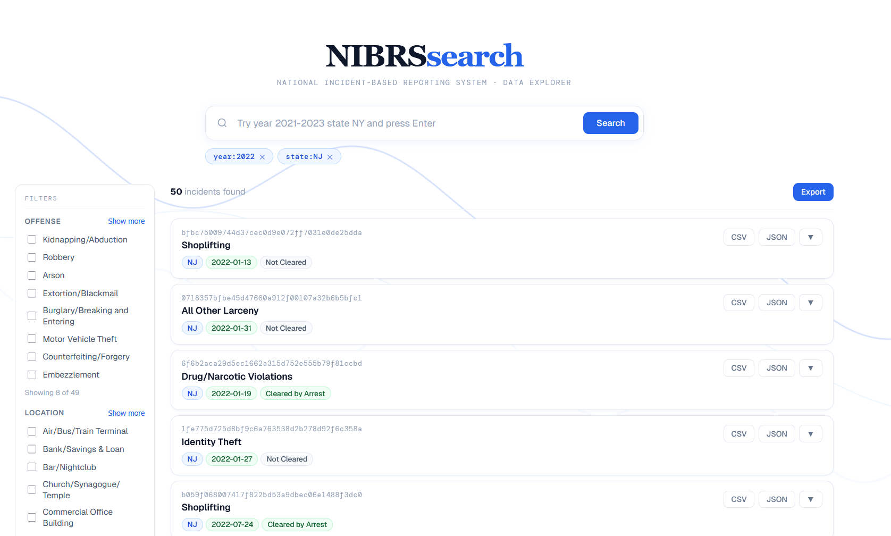
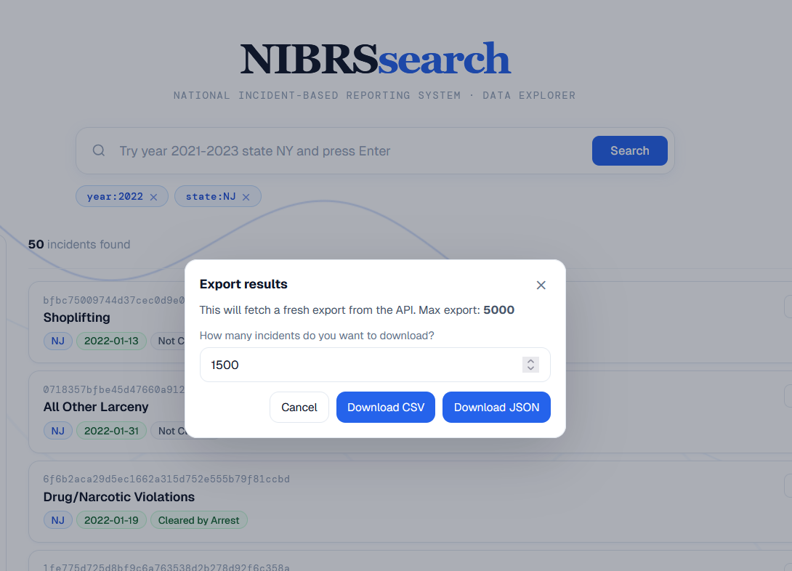

  

  <em>Search and explore FBI NIBRS crime data through a fast API and modern interface</em>

  
  
  
  

---

**Website**: https://nibrssearch.org

**Source Code**: https://github.com/that-dog-eater/nibrs-search

---

NIBRS Search is a fast platform for exploring **FBI National Incident-Based Reporting System (NIBRS)** crime data.

It provides a high-performance API and modern web interface for searching, filtering, and analyzing incident-level crime records across the United States.

The goal is to make large public safety datasets easier to access for:

- researchers
- journalists
- students
- civic tech developers
- policy analysts

---

## Key Features

* **Fast search**: Query millions of NIBRS incidents quickly using a DuckDB-based data warehouse.
* **Clean API**: Simple REST API built with **FastAPI**.
* **Modern UI**: Interactive search interface built with **Next.js**.
* **Structured data**: Crime incidents normalized and stored in columnar **Parquet** datasets.
* **Advanced filtering**: Filter by year, state, offense code, weapon, location, and more.
* **Incident bundles**: Retrieve related data such as arrests and offenses for each incident.
* **Open data focus**: Designed for researchers, journalists, and students working with public datasets.

---

## Architecture

The project consists of two main components.

---

## Interface

  

The NIBRS Search interface provides a fast way to explore incident-level crime data from the FBI's National Incident-Based Reporting System.

### What the interface includes

- **Search bar** – Quickly search incidents using keywords or identifiers.
- **Filter panel** – Narrow results by state, year, offense codes, weapons, location type, and other attributes.
- **Incident results** – Displays a list of matching incidents with key information.
- **Incident detail pages** – Each incident can be opened to view associated offenses, arrests, and related data.

### How to use the search

1. Enter a keyword or identifier into the **search bar**.
2. Apply filters from the **left panel** to refine results.
3. Browse the returned incidents.
4. Click an incident to view the full record and associated data bundle.

The interface is designed to allow users to quickly move from a broad search to a specific incident record.

---

## Exports

  

The export system allows users to download search results for further analysis.

### Supported export formats

- **JSON** – Structured machine-readable format for developers and APIs.
- **CSV** – Spreadsheet-friendly format for tools like Excel, Google Sheets, and R.
- **Full incident bundles** – Export incidents together with related offenses and arrests.

### How exports work

1. Perform a search using the search bar and filters.
2. Review the returned incident results.
3. Select the **Export** option.
4. Choose the desired format (JSON or CSV).
5. Download the dataset for local analysis.

Exports are generated directly from the API, ensuring the downloaded data matches the search results displayed in the interface.

This makes it easy to move from exploration to deeper analysis using tools such as:

- Python
- R
- Excel / Google Sheets
- data science notebooks

## Licence 
 This project is licenced under the terms of the MIT license.
